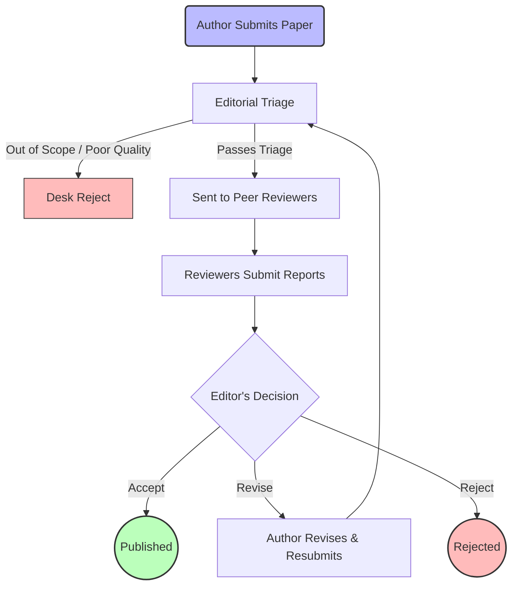

Peer review is the **foundational quality-control mechanism** of modern scientific publishing. It is the process by which a scholarly work is scrutinized by a group of experts in the same field (peers) before it is accepted for publication in a journal. 

Its primary goal is to filter out invalid, poorly designed, or unoriginal research, ensuring that only reliable knowledge enters the permanent scientific record.

## 1. How It Works: The Journey to Publication

1. **Submission:** The authors submit their finalized manuscript, data, and a cover letter to a target journal.
2. **Editorial Triage (Desk Review):** The journal's Editor-in-Chief or handling editor does a preliminary check. They assess whether the paper fits the journal's scope and meets basic quality standards.
    * *Outcome:* If it fails this check, it receives a **"Desk Reject"** (rejected without peer review).
3. **Peer Review:** If the paper passes triage, the editor sends it to 2–4 independent experts in the specific sub-field. These reviewers critically evaluate the methodology, data analysis, novelty, and conclusions.
4. **The Decision:** Based on the reviewers' reports, the editor makes a decision:
    * **Accept:** Extremely rare on the first round.
    * **Minor/Major Revisions:** The authors must perform additional experiments, rewrite sections, or address specific reviewer critiques, then resubmit.
    * **Reject:** The flaws are too fundamental to fix, or the finding is not significant enough for this specific journal.

> [!INFO] Who are the reviewers?
> Reviewers are active scientists and researchers. Surprisingly to many outsiders, **reviewers are not paid by the journal** for their time. It is considered a professional duty and a service to the scientific community.

## 2. Advantages: Why do we do it?

Despite its flaws, peer review remains the gold standard for scientific communication for several critical reasons:

* **Quality Control:** It acts as a filter, preventing fundamentally flawed methodologies, unsupported claims, or blatant plagiarism from gaining the legitimacy of a published article.
* **Constructive Improvement:** Good reviewers do not just look for reasons to reject a paper; they act as critical mentors. Their feedback often forces authors to clarify their writing, tone down exaggerated claims, or perform crucial control experiments that make the final paper significantly stronger.
* **Establishing Credibility:** For policymakers, doctors, and the public, the "peer-reviewed" label acts as a stamp of scientific validity, differentiating rigorous research from mere opinion or pseudoscience.

## 3. Current Challenges in Peer Review

The system is not perfect. As the volume of scientific research grows exponentially, the traditional peer-review model is showing signs of strain.

### Reviewer Fatigue
Because reviewing is unpaid and time-consuming, and the number of submitted papers is skyrocketing, editors are finding it increasingly difficult to find willing experts. This leads to bottlenecks and delays.

### Speed
The process is notoriously slow. It can take anywhere from a few months to over a year for a paper to go from submission to publication. In fast-moving fields (like during a global pandemic or in AI research), this delay is unacceptable, driving the rise of *preprints* (as discussed in [[9. The landscape of scientific literature]]).

### Bias and Lack of Transparency
Reviewers are human, and humans have biases. If a reviewer knows who authored the paper, they might be subconsciously influenced by the author's gender, nationality, or the prestige of their university.

> [!NOTE] Blinding in Peer Review
> Journals attempt to mitigate bias using different models of "blinding":
> * **Single-blind:** The reviewers know who the authors are, but the authors do not know who the reviewers are. (The most common model).
> * **Double-blind:** Neither the authors nor the reviewers know each other's identities. (Helps reduce prestige bias).
> * **Open Peer Review:** All identities are known, and the reviewer reports are published alongside the final article. (Encourages accountability and civil discourse).
