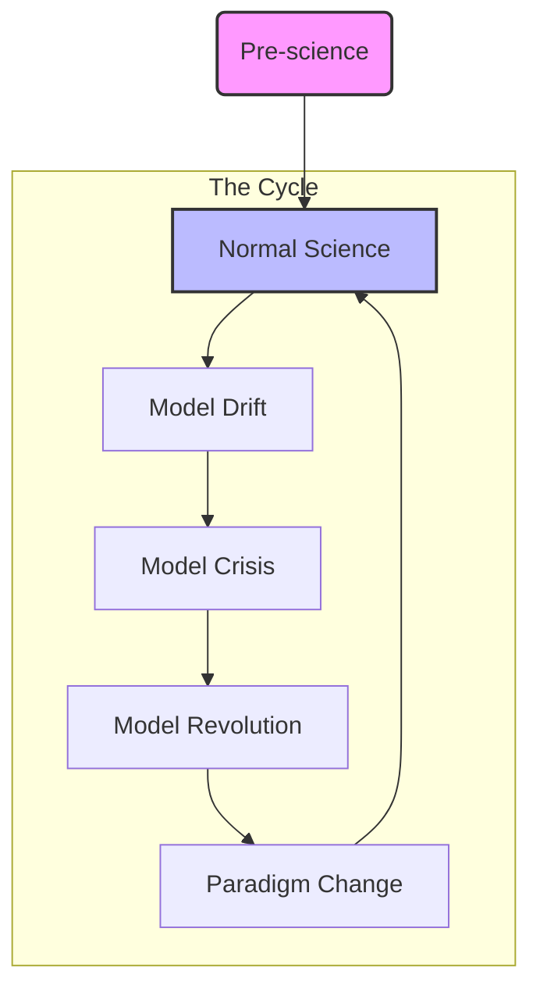

*The central question: How do we distinguish **Science** from **Non-Science** (art, religion) and **Pseudo-Science** (astrology, homeopathy)?*
### Early Attempts: Verificationism (The Vienna Circle)
* **Logical Positivism:** Believed a statement is only meaningful if it can be empirically verified.
    * *Example statement:* "In a vacuum, a heavy object (hammer) and a light object (feather) fall at the same speed."
    * *Verification:* This can be verified by creating a vacuum and observing the drop.
* **The Flaw:** You cannot verify universal statements. No matter how many white swans you see, you cannot prove "All swans are white."
### Karl Popper: Falsificationism
Popper shifted the focus from *verifying* theories to *testing* them.
#### Key Concepts:
1.  **Falsifiability:** (fɔːlsɪˌfaɪəˈbɪləti) For a theory to be scientific, there must be a potential observation that could prove it wrong.
    * *Example:* "It will rain tomorrow" is falsifiable (we can check). 
2.  **Corroboration, not Proof:** We never *prove* a theory is true; we only fail to disprove it. The theory "survives" testing.
3.  **The Black Swan:** Seeing 1,000 white swans proves nothing. Seeing **one** black swan falsifies the theory "All swans are white."

### Thomas Kuhn: The Structure of Scientific Revolutions
Kuhn argued that Popper's view was too idealistic. History shows science works differently.
#### Key Concepts 
- **1. Pre-science**: There is not yet a model of understanding (a central theory) mature enough to solve the field’s major problems.
	- *Example* Ancient Greece: Various competing schools of thought existed regarding the planets. No single agreed-upon method for calculating planetary positions.
2. **Normal Science**: A single foundational model drives the field or a portion of it.
	- The Earth is stationary at the center. Planets move in epicycles along larger circles (deferents). Model works well enough to predict star and planet positions for navigation and calendars.
 3. **Model Drif**t: Small anomalies the model cannot explain accumulate, but the model explains most phenomenon and still guides research.
	-  Observations got better, the predictions failed more often. Messy fixes were needed
 4. **Model Crisis**: Large anomalies make the model of understanding untenable. There is too much it cannot explain. The field is thrown into a crisis, and rapid search for a new model begins.
	 - By the 16th century, the Ptolemaic system was a monster of complexity. It was no longer simple or accurate. The calendar was drifting out of sync with the seasons 
5. **Model Revolution** New models appear, evolve, and compete to explain the anomalies radically better than old models. Finally a single general model emerges, based on one or more exemplar applications.
	- Copernicus places the Sun at the center, which simplifies the math. 
6. **Paradigm Change**: After new paradigm change resistance is overcome, the new model is uncritically accepted by most members of the field, taught to newcomers, and the cycle completes (returning to Normal Science).
	- Isaac Newton publishes the _Principia_, providing the physical laws (gravity) that prove the Heliocentric model works. The sun-centered system becomes the new  standard,  Astronomers return to "Normal Science" (calculating orbits) within this new framework.

> [!TIP] Comparison: Popper vs. Kuhn
> * **Popper:** Science is a logical process of **revolutionary criticism**. It is linear progress toward truth via error elimination.
> * **Kuhn:** Science is a social process of **conservative puzzle-solving** punctuated by sudden, irrational shifts. Truth is relative to the paradigm.

> [!QUESTION] Discussion 1: The Astrology Test
> Ask the class: **"Why is Astronomy science and Astrology pseudoscience?"**
> * *Challenge them:* Astrologers make predictions. They use data (planetary positions). They have complex rules.
> * *Goal:* Guide them to realizing Astrology fails **Popper’s test** (vague predictions that can fit any outcome, "Barnum effect") and **Kuhn’s test** (no progress, no puzzle solving, no reaction to anomalies).
